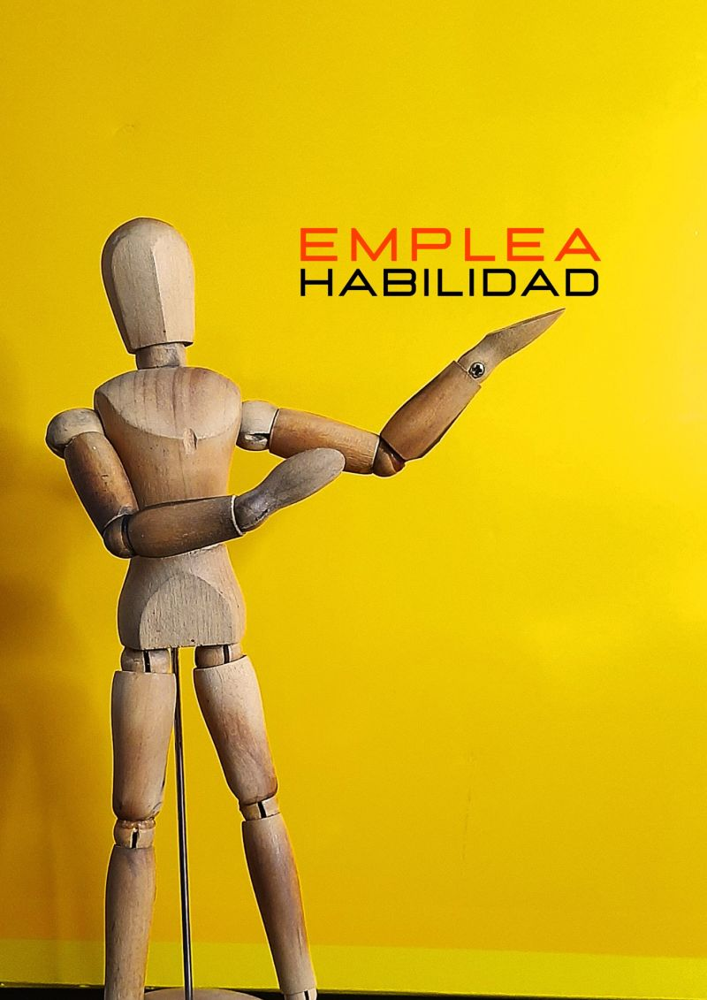

## 

:::: {.title-layout}

::: {.title-left}

::: {.title-tag}
✦ Edición 2026
:::

::: {.title-heading}
Tejiendo redes en datos: 
:::

::: {.title-sub}
empleabilidad y perfil profesional
:::

::: {.title-chips}
::: {.chip}
⚡ Brigitte Bergery
:::
::: {.chip .chip-blue}
🚀 EmpleaHabilidad
:::
:::
:::

::: {.title-right}
:::

::::

# Código de conducta

::: incremental
-   🛡️ Todos los espacios de participación R en Buenos Aires, se rigen por el Código de Conducta, ya sean conferencia, charla, taller, reunión, redes sociales y otros medios en línea. Conoce el [Código de conducta de R en Buenos Aires](https://renbaires.github.io/cdc)

-   🌈 Nuestro objetivo es que disfrutes este espacio. Si algo no está bien, contactate con el equipo coordinador o escribí un mail a renbaires@gmail.com
:::

<!--
## Agenda de hoy {background-color="#0D0D1A"}

::: {.columns-layout-3}

::: {.card}
::: {.big-number}
01
:::
**Contexto**

Por qué estamos acá y qué vamos a hacer juntos.
:::

::: {.card style="border-color: rgba(43,134,197,0.4);"}
::: {.big-number style="background: linear-gradient(135deg, #2B86C5, #FFD200); -webkit-background-clip: text; -webkit-text-fill-color: transparent; background-clip: text;"}
02
:::
**El tema central**

La idea principal de la charla con ejemplos reales.
:::

::: {.card style="border-color: rgba(247,151,30,0.4);"}
::: {.big-number style="background: linear-gradient(135deg, #F7971E, #FF3CAC); -webkit-background-clip: text; -webkit-text-fill-color: transparent; background-clip: text;"}
03
:::
**Cierre & Q&A**

Preguntas, conversación abierta y próximos pasos.
:::

:::

## Los oradores {background-color="#0D0D1A"}

::: {.speakers-grid}

::: {.speaker-card}
::: {.speaker-photo-placeholder style="background: linear-gradient(135deg, #FF3CAC, #784BA0);"}
👤
:::
::: {.speaker-name}
Nombre Orador 1
:::
::: {.speaker-role}
::: {.chip .chip-blue style="margin:0;"}
🏢 Empresa / Rol
:::
:::
::: {.speaker-bio}
Una línea que resume quién es y por qué está acá.
:::
:::

::: {.speaker-card}
::: {.speaker-photo-placeholder style="background: linear-gradient(135deg, #2B86C5, #FFD200);"}
👤
:::
::: {.speaker-name}
Nombre Orador 2
:::
::: {.speaker-role}
::: {.chip .chip-yellow style="margin:0;"}
🔬 Área de expertise
:::
:::
::: {.speaker-bio}
Una línea que resume quién es y por qué está acá.
:::
:::

::: {.speaker-card}
::: {.speaker-photo-placeholder style="background: linear-gradient(135deg, #F7971E, #FF3CAC);"}
👤
:::
::: {.speaker-name}
Nombre Orador 3
:::
::: {.speaker-role}
::: {.chip style="margin:0;"}
💡 Especialidad
:::
:::
::: {.speaker-bio}
Una línea que resume quién es y por qué está acá.
:::
:::

:::
-->

# El equipo organizador

::: {.org-header}
Las personas que hacen posible este evento
:::

::: {.org-grid}

::: {.org-card}
::: {.org-photo-placeholder;"}
{width="70%" style="border-radius: 80%;"}
:::
::: {.org-name}
Andrea Gomez Vargas
:::
::: {.org-role}
Organizadora
:::
:::

::: {.org-card}
::: {.org-photo-placeholder"}
{width="70%" style="border-radius: 80%;"}
:::
::: {.org-name}
Ariana Bardauil
:::
::: {.org-role}
Organizadora
:::
:::

::: {.org-card}
::: {.org-photo-placeholder;"}
{width="70%" style="border-radius: 80%;"}
:::
::: {.org-name}
 Emanuel Ciardulo
:::
::: {.org-role}
Organizador
:::
:::

:::

## Presenta {background-color="#0D0D1A"}

::: {.speakers-grid}

::: {.speaker-card}
::: {.speaker-photo-placeholder;"}
{width="70%" style="border-radius: 80%;"}
:::
::: {.speaker-name}
Brigitte Bergery
:::
::: {.speaker-role}
::: {.chip .chip-blue style="margin:0;"}
🏢 Emplea Habilidad
:::
:::
::: {.speaker-bio}
Speaker y asesora de empleabilidad
:::
:::

::: {.speaker-card}
::: {.speaker-photo-placeholder"}

:::

<!--
::: {.speaker-name}
Nombre Orador 2
:::
::: {.speaker-role}
::: {.chip .chip-yellow style="margin:0;"}
🔬 Área de expertise
:::
:::
::: {.speaker-bio}
Una línea que resume quién es y por qué está acá.
:::
-->
:::

:::
<!-- ══════════════════════════════════════════════════
     SLIDE 7 · ¡ARRANCAMOS!
     ══════════════════════════════════════════════════ -->
## ¿Listos? {background-color="#0D0D1A"}

::: {style="text-align: center; padding-top: 1rem;"}

::: {style="font-size: 0.65em; letter-spacing: 0.15em; text-transform: uppercase; color: #9B9BB8; margin-bottom: 0.5rem;"}
Empezamos en
:::

::: {.big-number style="font-size: 5.5em;"}
3... 2... 1...
:::

::: {style="margin-top: 1.5rem;"}
::: {.chip}
✦ Prepárense
:::
::: {.chip .chip-blue}
🎙️ La charla arranca
:::
:::

::: {style="margin-top: 2rem;"}

:::

::: {style="font-size: 0.65em; color: rgba(240,238,255,0.35); margin-top: 0.5rem;"}
Slides disponibles en [tu-link.com]{style="color: #FF3CAC;"}
:::

:::
